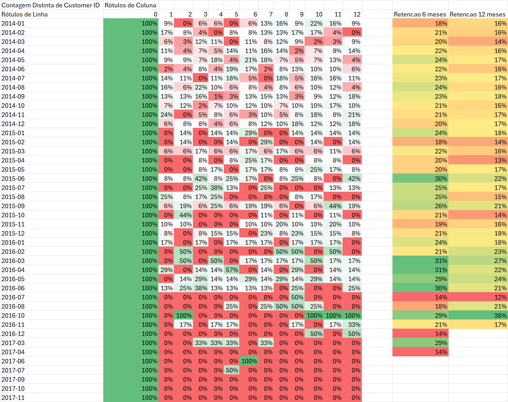
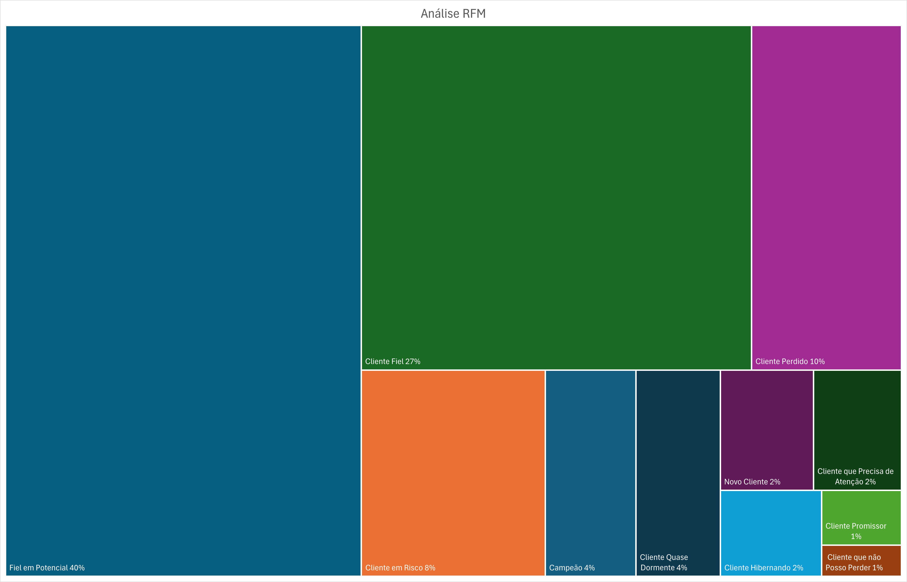
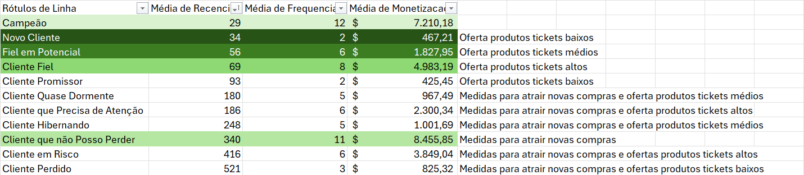
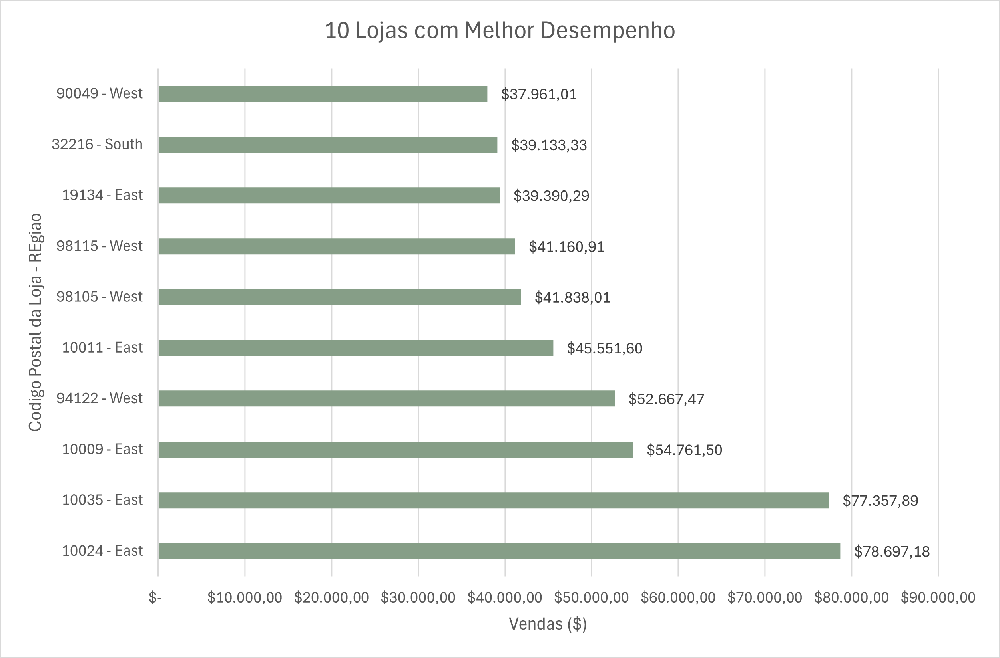
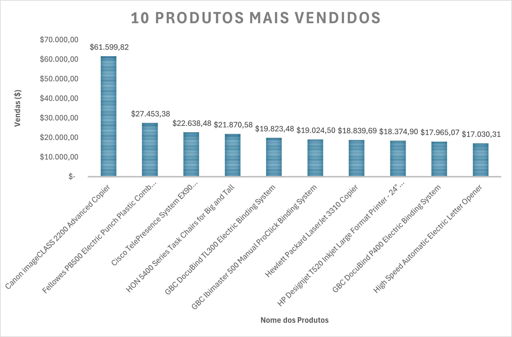
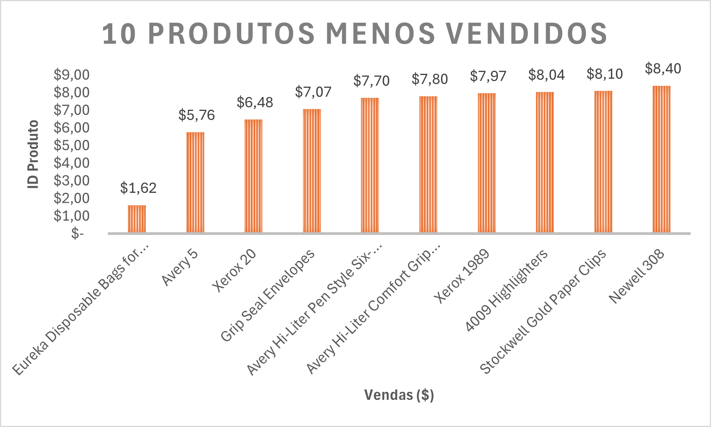
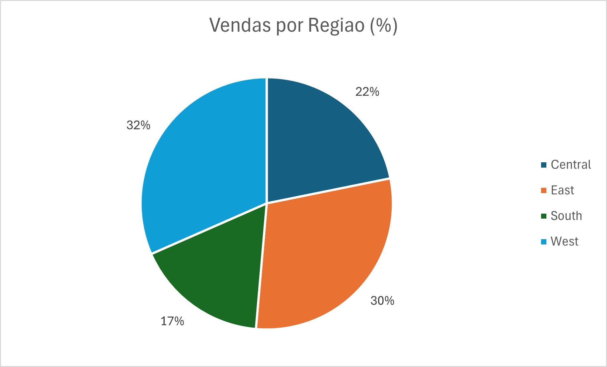

# Análise de Dados do Superstore (Supermercado Fictício)

# Contexto
A SuperStore é uma rede de supermercados com várias unidades físicas espalhadas por todo, no qual fornece alimentos e comercializa os mais diversos produtos para consumo.

Os gerentes decidiram construir uma equipe de analistas de dados para auxiliar nas decisões da empresa no tocante ao abastecimento de produtos das lojas e das vendas, cuja decisão ainda depende de algumas planilhas de dados com informações pontuais. 

# Objetivos
A meta é a integração de todos os dados da empresa em que cada área acompanhe os mesmos indicadores, além da criação de novos para o acesso aos dados transacionais para a análise do comportamento dos clientes, a descrição dos produtos e o desempenho das lojas físicas da rede.

O time de gestão identificou três áreas principais para foco:

1. Retenção de clientes: monitorar a interação de clientes ao longo do tempo (análise de Cohort).
2. Segmentação de clientes: identificar grupos específicos de clientes com base no comportamento de compra (RFM).
3. Desempenho de produtos e localizações: avaliar quais produtos e lojas geram maior impacto no faturamento.

# Estratégia da Solução

## Passo 1: Resumir o contexto em uma pergunta aberta
Para o resumo do contexto, utiliza-se as perguntas para torna-las mais compreensíveis ao público-alvo, que são os decisores de negócios. Entretanto, dividimos-nas em duas categorias: as abertas e as fecahdas.

A principal pergunta aberta é:
**Como podemos atrair os clientes mais rentáveis e aumentarmos o faturamento da empresa?**

## Passo 2: Transformar pergunta aberta em fechada
Depois das perguntas abertas, faz-se perguntas fechadas, nos quais detalham os procedimentos da análise de dados.

São elas:
**Qual é a retenção de clientes ao longo dos meses?**
**Quais cohorts apresentam maior retenção?**
**Existem fatores sazonais que impactam a retenção?**
**Quem são os “Campeões” e “Clientes em Risco”?**
**Como os clientes estão distribuídos entre os segmentos RFM?**
**Quais ações podem ser tomadas para fidelizar clientes ou recuperar os em risco?**
**Quais produtos geram maior receita e quais possuem baixo desempenho?**
**Existe uma relação entre o desempenho das lojas e as regiões em que estão localizadas?**

## Passo 3: Definição da coluna Fato
A coluna Order ID foi considerada a coluna Fato pelo fato de ter valores únicos de cada pedido feito e, portanto, será o objetivo destre trabalho.

## Passo 4: Identificação das dimensões
1. Costumers
   - Costumer ID
   - Costumer Name
   - Segment
2. Location
   - Country
   - City
   - State
   - Postal Code
   - Region
3. Orders
   - Order Date
   - Ship Date
   - Ship Mode
   - Costumer ID
   - Product ID
   - Sales
   - Quantity
   - Discount
   - Profit
4. Product
   - Product ID
   - Category
   - Sub-category
   - Product Name

## Passo 5: Critérios de priorização
Critério 1: Dados disponíveis

Critério 2: Insights adicionais

# Insights da Análise
Análise de Cohort, de janeiro de 2014 a abril de 2017

Proporções de segmentos de clientes e as seguintes recomendações

Segmentação dos clientes e as seguintes recomendações

10 lojas com melhor desempenho de vendas

10 produtos mais vendidos

10 produtos menos vendidos

Proporção de vendas por região

# Resultado

# Visualização da Análise Completa
